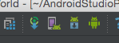
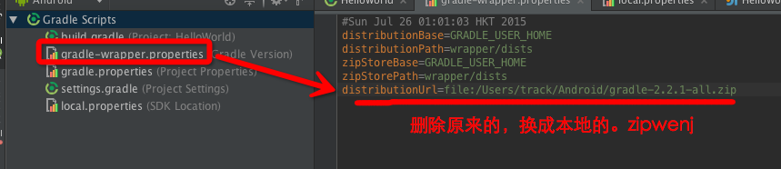
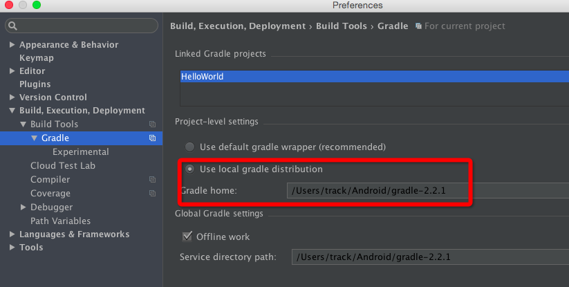

#     @Track   24245@163.com   转载请注明来源!
# 学习Android Studio使用简诉
1.  Android Studio介绍以及与Eclipse相比
2.  Android Studio 下载，安装
3.  Android Studio 基本配置与运行
4.  Android Studio 快捷键
5.  Android Studio Gradle基础
6.  Android Studio 导入第三方开源项目 
7.  Android Studio 打包
8.  Android Studio 插件之GsonFormat
9.  Android Studio 导入Eclipse项目

## 1. Android Studio介绍以及与Eclipse相比
> 1.Android Stuio是什么？
>>   1. Android Studio是Google于2013 I/O大会针对Android开发推出的新的开发工具，目前很多开源项目都已经在采用。官方称将与15年停止对Eclipse Android开发的支持。

> 2.Android Studio VS Eclipse
>>   1. Android Stuido是Google推出，专门为Android“量身订做”的，是Google大力支持的一款基于IntelliJ IDEA改造的IDE。
>>   2. Android Studio的启动速度、响应速度、内存占用优于Eclipse。 （其实，Android Studio配置要求偏高）
>>   3. Android Studio的UI更加漂亮，比如说自带的Darcula主题的炫酷，Eclipse看着有点low。
>>   4. Android Studio更加智能化，智能，智能保存，等开发效率大大提升。
>>   5. Android Studio整合了Gradle构建工具，Eclipse要依赖与插件形式，有点麻烦。
>>   6. Android Studio中强大的UI编辑器，多设备时预览。
>>   7. Android Studio内置终端，这对于习惯命令行操作的人超级省事。
>>   8. Android Studio 更完善的插件系统，tudio下支持各种插件，如Git、Markdown、Gradle等等。
>>   9. Android Studio 自带了如GitHub, Git, SVN等流行的版本控制系统。
>>   10. Android Studio将会越来越完善，越来越强大！

## 2. Android Studio 下载，安装
> 1.Android Studio下载
>>   1. 从[国内Android开发环境下载](http://androiddevtools.cn/)下载最新版的AndroidStudio，然后配置好SDK环境变量，最好下载对应的source，buildtools啥的，不然你得翻墙下载哦！
>>   2. Android Studio中有Project和Module的概念，Studio中一个窗口只能有一个项目，即Project，代表一个workspace，但是一个Project可以包含多个Module，比如你项目引用的Android Library, Java Library等，这些都可以看做是一个Module;

## 3. Android Studio 基本配置与运行
> 1.配置主题
>>   1. 到Preference -> Appearance下更改主题到Darcula,再apply,炫酷黑主题，当然还有各种，自己喜欢就好！

> 2.配置代码区域字体大小
>    1. 到 Preferences (设置)页面搜索 Font 找到 Colors&Fonts 下的 Font 选项，我们可以看到默认字体大小是12，但是无法修改，需要先保存才可以修改，点击 Save as 输入一个名字，比如 MyDarcular，然后就可以修改字体大小和字体样式了.

> 3.配置其他视图字体大小
>    1.到 Preferences -> Appearance 中， Overred default  fonts.. 配置一下大小即可。

> 4.小工具栏
>>    
>>   1.Gradle，AVDManager,SDKManager,DDMS(Dalvik Debug Monitor Service) 并排的四个图标。 

> 5.配置gradle
>>  
>>  
>>   1.配置本地gradle，如上图！

> 6. 运行APP
>>   1.选中项目，run就行了。 要是debug，就debug， mac下快捷键^+R,windows应该是CRTL+F11吧。

> 7. 自动导包
>>   1. 到 Preferences -> Editor -> Auto Import -> Java 把以下选项全勾上就OK了。

## 4. Android Studio 快捷键
> 1.快捷键设置
>>   1. Preferences -> Keymap 然后就可以选择你想要的快捷键，这里不止可以选择Eclipse，还可以选择 Emacs、Net Beans 等编辑器的快捷键,虽然能过渡的同学一个适应， 最好还是掌握下android studio的快捷吧！
> 2.常用快捷键
>>   1. [百度经验](http://jingyan.baidu.com/article/574c5219ce55e96c8d9dc105.html)，自己也可以网上找找咯。

## 5. Android Studio Gradle基础(整个项目以Project视图)
> 什么是Gradle`(1)`,他的特点是什么`(2-7)`?
>> 1. Gradle 是一个先进的构建系统和构建工具，它允许通过插件创建自定义的构建逻辑。
>> 2. 使用域特定语言 （DSL） 来描述和处理构建逻辑.
>> 3. 构建文件基于 Groovy ，并允许通过 DSL来混合声明性元素，以及使用代码来处理 DSL 元素以提供自定义逻辑。
>> 4. 基于 Maven 和 Ivy 的内置依赖管理。
>> 5. 非常灵活。允许使用最佳实现，但并不强制自己的实现方式。										
>> 6. 插件可以提供自己的 DSL 和API供构建文件使用。
>> 7. 良好的Tooling API 供 IDE 集成

> 1.application,library,的build.gradle (Module)
>>  
>>  
>>  

> 2.Android整个项目的build.gradle
>> 
>> 内容主要包含了两个方面：一个是声明仓库的源，这里可以看到是指明的jcenter(), 之前版本则是mavenCentral(), jcenter可以理解成是一个新的中央远程仓库，兼容maven中心仓库，而且性能更优。另一个是声明了android gradle plugin的版本，android studio 1.0正式版必须要求支持gradle plugin 1.0的版本。

> 3.Gradle配置再,gradle/wrapper/gradle-wrapper.properties
>> 
>> 可以看到里面声明了gradle的目录与下载路径以及当前项目使用的gradle版本，这些默认的路径我们一般不会更改的，这个文件里指明的gradle版本不对也是很多导包不成功的原因之一。

> 4.settings.gradle
>> 
>> 这个文件是全局的项目配置文件，里面主要声明一些需要加入gradle的module，include ':app', ':extras:ShimmerAndroid'
文件中的 app, extras:ShimmerAndroid 都是module，如果还有其他module都需要按照如上格式加进去。

[Lint错误](http://mikewang.blog.51cto.com/3826268/1003276)

## Gradle 基础打包命令
> 1.查看gradle版本
>>   1. ./gradlew --version 或者 ./gradlew -v

> 2.下载依赖, 清除/app目录下的build文件夹
>>   1. ./gradlew clean

> 3.编译打包 (app/build/outputs/apk 目录下会看到类似于app-debug-unaligned.apk, app-release-unsigned.apk等，看名字应该能理解意思，unaligned代表没有进行zip优化的，unsigned代表没有签名的)
>>   1. ./gradlew build

> 4.编译,只生成调试包
>>   1. ./gradlew assembleDebug
 
> 5.编译,只生成发布包
>>   1. ./gradlw assembleRelease

> 6.编译,生成发布包并安装
>>   1. ./gradlew installRelease

> 7.卸载发布包
>>   1. ./gradlew uninstallRelease

> 8. 让Gradle自动生成Intellij的项目文件，需要使用idea插件,或者eclipse项目
>>   1. gradle cleanIdea idea 可以清除已有的Intellij项目文件
>>   2. gradle idea 生成Intellij项目文件
>>   2. gradle eclipse 生成Eclipse项目文件

> 9.渠道打包
>>   1. ./gradlew assembleWandoujiaRelease 打包wandoujia渠道的release版本
>>   2. ./gradlew assembleWandoujia 生成wandoujia渠道的Release和Debug版本
>>   3. ./gradlew assembleRelease 将Product Flavor下的所有渠道的Release版本都打出来。

> 总之，assemble 命令创建task有如下用法：
>> **assemble**： 允许直接构建一个Variant版本，例如assembleFlavor1Debug。
>> **assemble**： 允许构建指定Build Type的所有APK，例如assembleDebug将会构建Flavor1Debug和Flavor2Debug两个Variant版本。
>> **assemble**： 允许构建指定flavor的所有APK，例如assembleFlavor1将会构建Flavor1Debug和Flavor1Release两个Variant版本。

## 生成aar，并导入
* 目前android gradle插件并不支持本地直接使用*.aar文件，不过，支持包管理库
Warning:Project app: Only Jar-type local dependencies are supported. 

http://www.csdn123.com/html/topnews201408/47/4447.htm
http://www.chengxuyuans.com/Android/85526.html
http://mikewang.blog.51cto.com/3826268/1003276
http://blog.jobbole.com/72992/
http://www.it165.net/pro/html/201407/17408.html
http://www.android-studio.org/index.php/docs/experience/152-android-studio-aar
http://www.2cto.com/kf/201505/400358.html
http://www.jcodecraeer.com/a/anzhuokaifa/androidkaifa/2014/1108/1935.html
http://my.oschina.net/mutour/blog/157374
http://www.zhihu.com/question/27027667
http://blog.csdn.net/h3c4lenovo/article/details/43566169
http://www.111cn.net/sj/android/74260.htm
http://my.oschina.net/xesam/blog/213953
http://my.oschina.net/u/1471093/blog/341990
http://www.open-open.com/lib/view/open1415793464648.html
http://blog.jobbole.com/72992/
http://stormzhang.com/devtools/2015/01/15/android-studio-tutorial6/
http://www.tuicool.com/articles/FbAbamY
http://blog.sina.com.cn/s/blog_a83d1bb20102uzp9.html
http://stackoverflow.com/questions/18328730/how-to-create-a-release-signed-apk-file-using-gradle
https://github.com/ihrthk/android-gradle-mulchannel-plugin
https://dzone.com/refcardz/mvvm-design-pattern-formula
https://dzone.com/refcardz/android-application
https://docs.gradle.org/current/dsl/org.gradle.api.artifacts.repositories.IvyArtifactRepository.html
http://www.it165.net/pro/html/201407/17686.html
https://github.com/ShinChven/MigrateToGradle
https://linux.cn/article-4046-1.html
http://www.geekcome.com/content-10-2336-1.html
http://www.cnblogs.com/xrwang/p/AndroidStudioImportJarAndSoLibrary.html
http://blog.csdn.net/look_down/article/details/16370615

